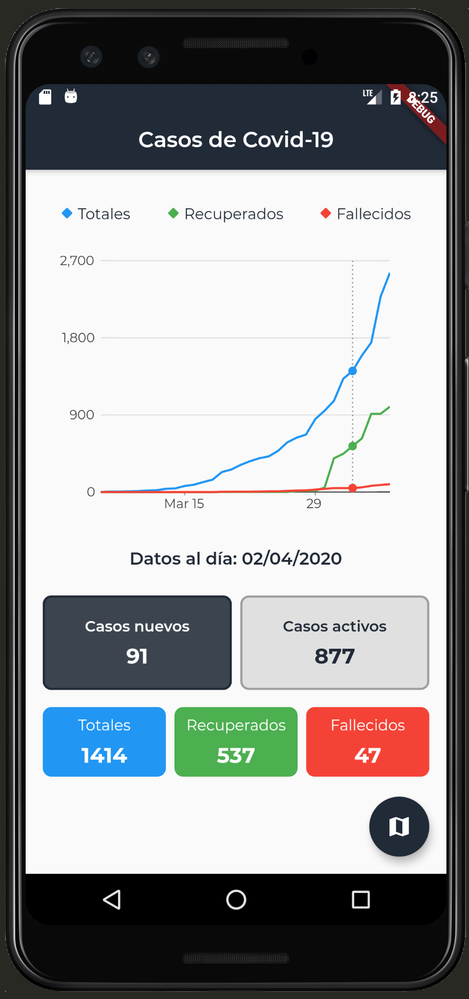
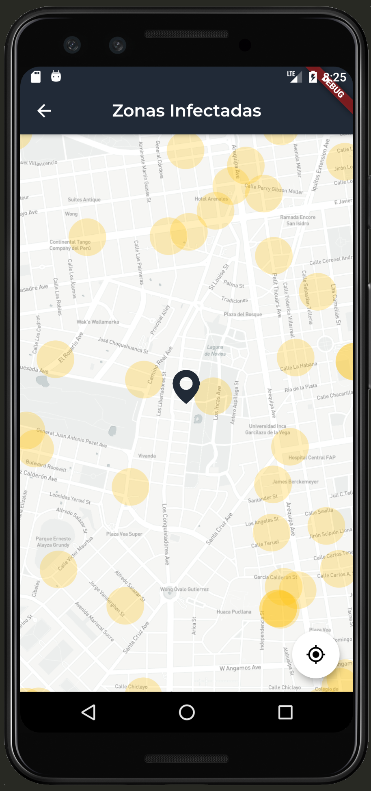
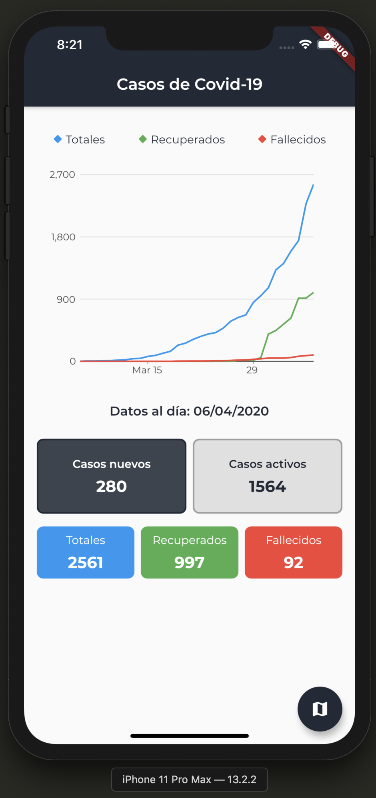
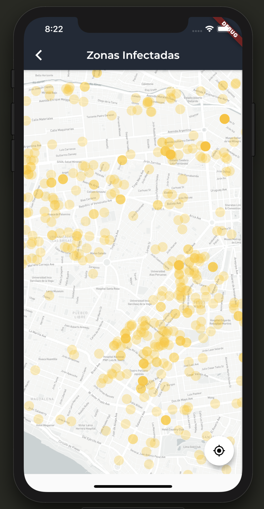

# Covid19

A new Flutter project.

## Screenshots

| Android Chart | Android Map |
| --- | --- |
|  |  |

| iOS Chart | iOS Map |
| --- | --- |
|  |  |

## What could you found here

* An attempt to implement bloc pattern (still not quite get it)
* Usage of `sqflite` package to handle local database
* Usage of `http` package to make http request
* Usage of `charts_flutter` package to draw some cool chats